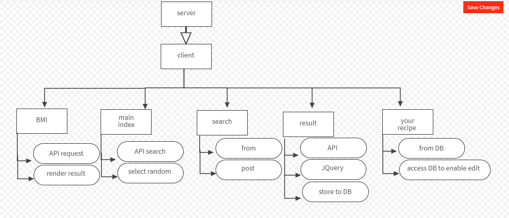

# wasfatcom

## app that use to find recipes for your food and to take care of your health by giving the Bmi test to your body and to provide the nutrition fact about your food 

## you will be able to search for your food and you will suggest food for you to let you try new food 

## we are sure that we will be providing the best recipe but we also believe that you can make it better so we will let you be able to edit the recipe as you wish 

## Domain Modeling

## Database Entity-Relationship-Diagram

we will have only one data base that will inclode the recipe 
inside the table there is title ,calorise ,ingredientLines and dietLabels.

## user story

As a user I want to search for some recipe and added to my favorite. I can add my own recipe and I can edit and delete the recipe and I can see the calories for every recipe

As a user of the app, I can know the ideal weight, and my health by entering height and weight

as a user I would like to see a comfortable user interface to the website and moving with pages easily

as an administrative user , I want to Update DataBase with new recipe

# thank you
